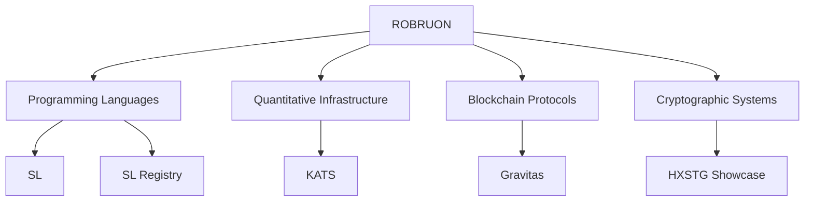

Independent engineering and applied research focused on compiler construction, quantitative infrastructure, cryptographic systems, and decentralized protocols.

&nbsp;

---

> [!NOTE]
>
> **ROBRUON** is an independent engineering organization dedicated to designing and building long-lived software ecosystems.
>
> Public repositories represent active research and implementation across programming languages, quantitative infrastructure, cryptographic tooling, and blockchain protocols. Rather than producing isolated applications, projects are developed as cohesive ecosystems emphasizing architecture, performance, maintainability, and extensibility.

---

# Engineering Domains

| Domain | Focus |
|:--|:--|
| **Compiler Construction** | Programming Languages • LLVM • Runtime Systems • Toolchains |
| **Quantitative Infrastructure** | Market Data • Execution Systems • Distributed Services • Machine Learning |
| **Cryptographic Systems** | Secure Tooling • Data Transformation • Command-Line Utilities |
| **Blockchain Protocols** | Smart Contracts • Protocol Design • Economic Models |

---

# Software Ecosystems

| Ecosystem | Description |
|:--|:--|
| **SL** | A statically typed programming language featuring a handwritten frontend, LLVM backend, runtime, and package ecosystem. |
| **KATS** | Real-time quantitative trading infrastructure with execution services, dashboards, machine learning components, and broker integrations. |
| **Gravitas** | Research into decentralized capital allocation and protocol economics implemented through Solidity smart contracts. |
| **HXSTG** | Cryptographic tooling focused on secure text transformation, archival systems, and command-line utilities. |

---

# Ecosystem Architecture

---

# Featured Projects

<!-- FEATURED:START -->

<!-- FEATURED:END -->

---

# Organization Metrics

<!-- METRICS:START -->

<!-- METRICS:END -->

---

# Latest Releases

<!-- RELEASES:START -->
<!-- RELEASES:END -->

---

# Recent Engineering Activity

<!-- ACTIVITY:START -->
<!-- ACTIVITY:END -->

---

# Active Development

## Programming Languages

### SL

The SL ecosystem is currently focused on advancing a complete programming language platform, including compiler infrastructure, runtime systems, package management, and future developer tooling.

Current priorities include:

- LLVM backend development
- Runtime architecture
- Standard library expansion
- Package registry ecosystem
- Toolchain maturity

---

## Quantitative Infrastructure

### KATS

KATS is an engineering platform for real-time quantitative research and execution.

Current priorities include:

- Execution engine improvements
- Broker integrations
- Market data infrastructure
- Dashboard enhancements
- Machine learning workflows

---

## Blockchain Protocols

### Gravitas

Gravitas explores decentralized capital allocation through original protocol design and economic modeling.

Current priorities include:

- Economic simulations
- Protocol validation
- Smart contract architecture
- Security analysis

---

## Cryptographic Systems

### HXSTG

HXSTG is a collection of cryptographic utilities centered around secure text transformation and archival systems.

Current priorities include:

- CLI tooling
- Binary distribution
- Secure archive improvements
- Developer experience

---

# Engineering Principles

ROBRUON projects are guided by a consistent set of engineering principles.

- Build software ecosystems rather than isolated applications.
- Research before implementation.
- Favor explicit architecture over unnecessary abstraction.
- Design for long-term maintainability.
- Optimize for correctness before optimization.
- Treat software as infrastructure.

---

# Repository Organization

<!-- REPOS:START -->
Repositories are intentionally separated into focused engineering domains.

| Repository | Purpose |
|:--|:--|
<!-- REPOS:END -->

---

# Collaboration

> [!IMPORTANT]
>
> ROBRUON repositories represent active engineering and research initiatives.
>
> Pull requests are generally **not accepted**.
>
> Issues, technical discussions, bug reports, and professional inquiries are always welcome.

---

### Explore the ROBRUON Ecosystem

Compiler Construction • Quantitative Infrastructure • Cryptographic Systems • Blockchain Protocols

 

&nbsp;

  

⭐ Follow the organization to stay informed about future releases and engineering updates.

