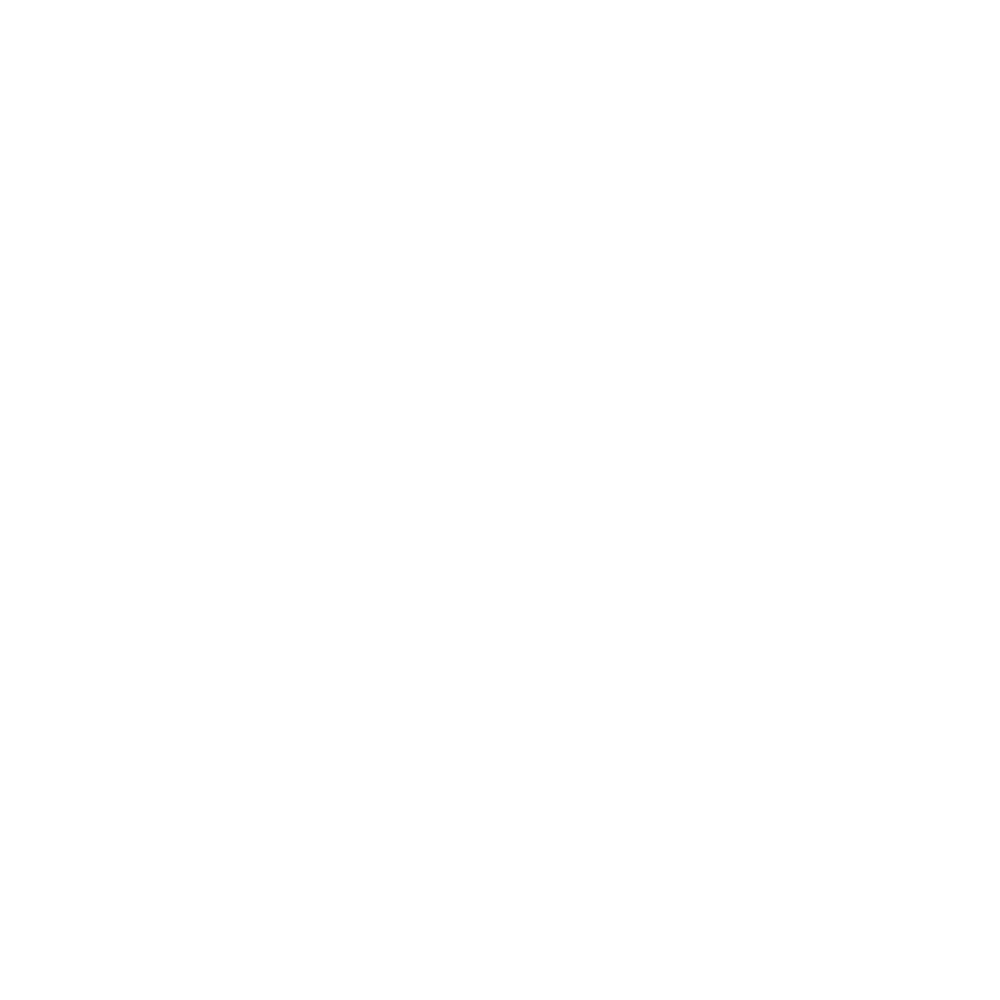
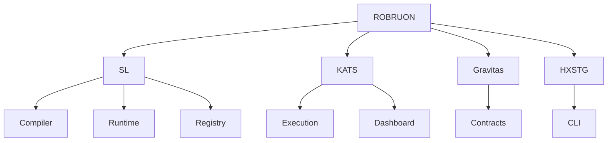

# ROBRUON

### Engineering software ecosystems from first principles.

Independent engineering and applied research spanning:

**Compiler Construction · Quantitative Infrastructure · Cryptographic Systems · Blockchain Protocols**

 

<a href="https://robruon.com">
Website
</a>
&nbsp;•&nbsp;
<a href="https://dev.robruon.com">
Engineering Portfolio
</a>

---

> [!NOTE]
> 
> ROBRUON is an independent engineering organization focused on designing
> and building long-lived software ecosystems.
>
> Public repositories represent research and engineering efforts across
> programming languages, quantitative systems, cryptographic tooling,
> and decentralized protocols.

## Engineering Domains

| Domain | Focus |
|---|---|
| Compiler Construction | Programming Languages · LLVM · Runtime Systems |
| Quantitative Infrastructure | Execution Systems · Market Data · Distributed Services |
| Cryptographic Systems | Secure Tooling · Data Transformation |
| Blockchain Protocols | Smart Contracts · Economic Models |

## Software Ecosystems

| Ecosystem | Description |
|---|---|
| **SL** | Programming language, compiler, runtime, and package ecosystem |
| **KATS** | Quantitative trading infrastructure and execution systems |
| **Gravitas** | Smart contract protocol and economic model research |
| **HXSTG** | Cryptographic tooling and secure archive systems |

## Architecture

## Featured Projects

## Organization Metrics

## Current Research

### SL
Programming language ecosystem:
* Compiler architecture
* LLVM backend
* Runtime systems
* Package infrastructure

### KATS
Quantitative infrastructure:
* Execution systems
* Broker connectivity
* Market data
* Research tooling

### Gravitas
Protocol research:
* Smart contract architecture
* Capital allocation models
* Economic simulations

### HXSTG
Cryptographic tooling:
* Secure transformation systems
* CLI utilities
* Archive technologies

## Technology
### Languages
Python • C • TypeScript • Solidity

### Infrastructure
LLVM · FastAPI · Next.js · SQLite · PyTorch · Hardhat

## Engineering Philosophy
* Build ecosystems instead of isolated applications.
* Research before implementation.
* Prefer explicit architecture.
* Optimize for long-term maintainability.
* Treat software as infrastructure.

---

> [!IMPORTANT]
> 
> ROBRUON repositories represent active engineering and research initiatives.
> 
> Pull requests are generally not accepted.
> 
> Technical discussions and professional inquiries are welcome.

---

⭐ Follow ROBRUON for future engineering releases.

